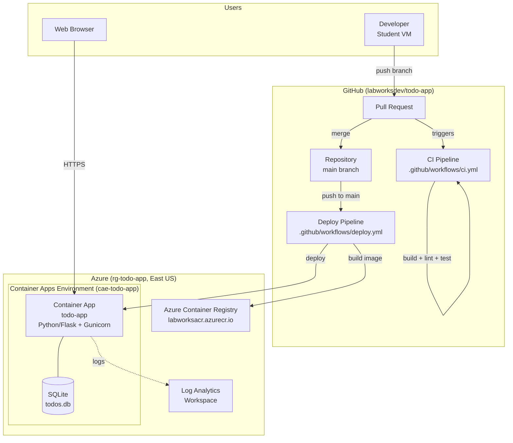
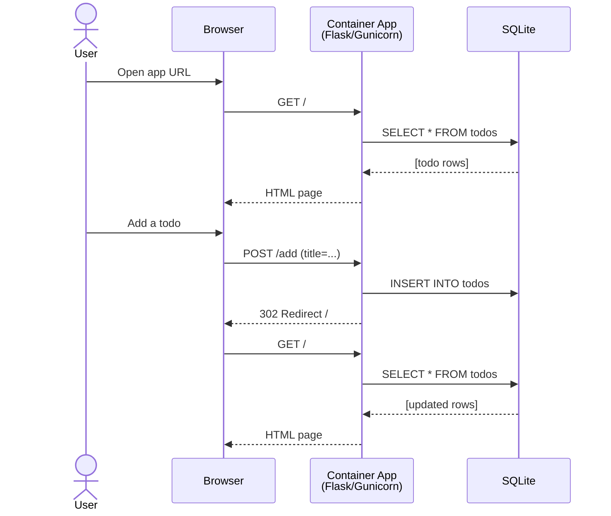
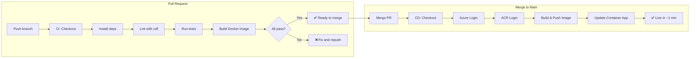
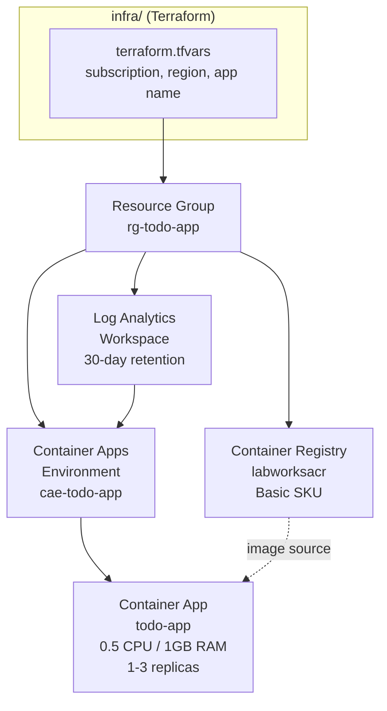
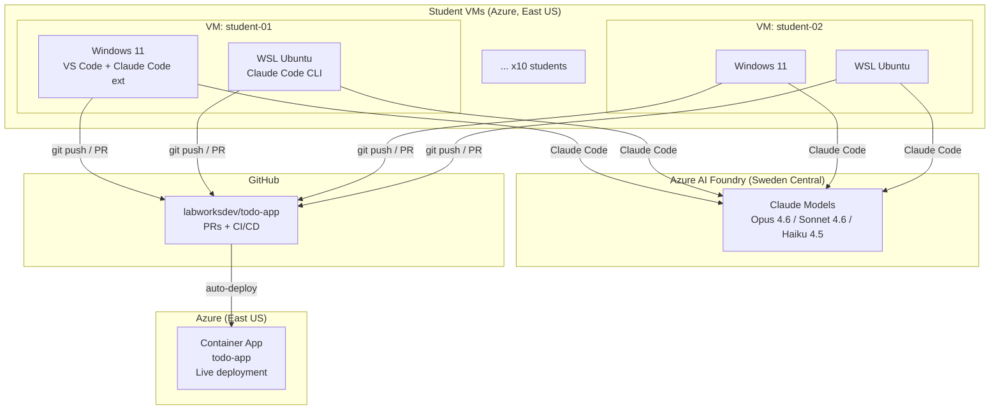
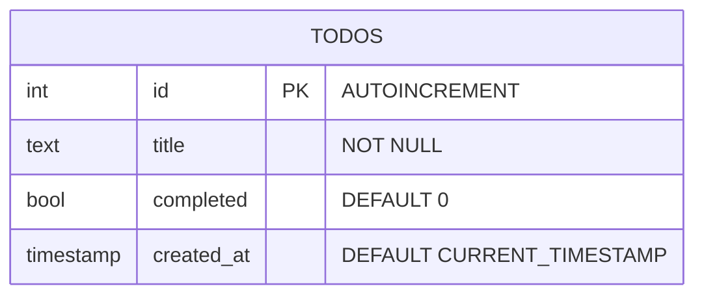
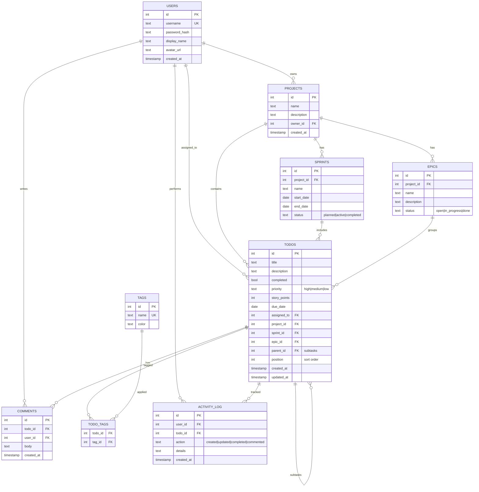

# Architecture

## System Overview

## Request Flow

## CI/CD Pipeline

## Infrastructure (Terraform)

## Workshop Architecture (Full Picture)

## Data Model (Current)

## Future Data Model (Target)

